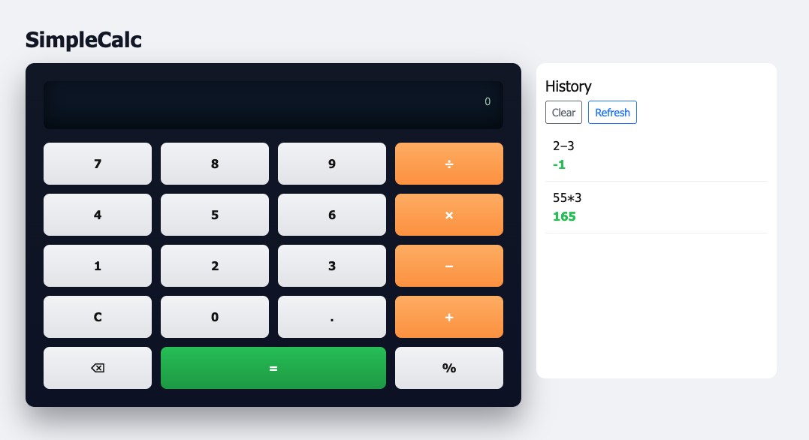

# Simple Calculator

This project is a small Node/Express app that renders a retro-styled calculator UI and stores a history of calculations in MongoDB.

Screenshot:



Key features:
- Calculator UI with keypad and result display
- Stores calculation history (expression, result, timestamp) in MongoDB
- History is shown in a side panel and can be cleared

Prerequisites:
- Docker & Docker Compose installed

Start the app with Docker Compose (build the images, start containers):

```bash
docker compose up --build
```

To keep files in sync while developing (watch mode), run:

```bash
docker compose watch
```

Then open your browser at:

```
http://localhost:3000
```

Notes:
- The default MongoDB connection used by the app is configured in `app/config/keys.js` (defaults to `mongodb://todo-database:27017/todoapp`).
- If you change container/service names in `compose.yaml`, update the MongoDB URI accordingly.

If you'd like, I can also add a short troubleshooting section or a `Makefile` with common dev commands.